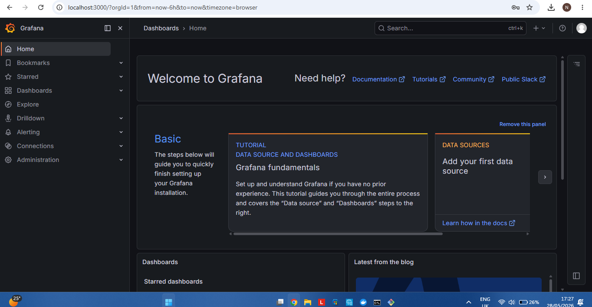
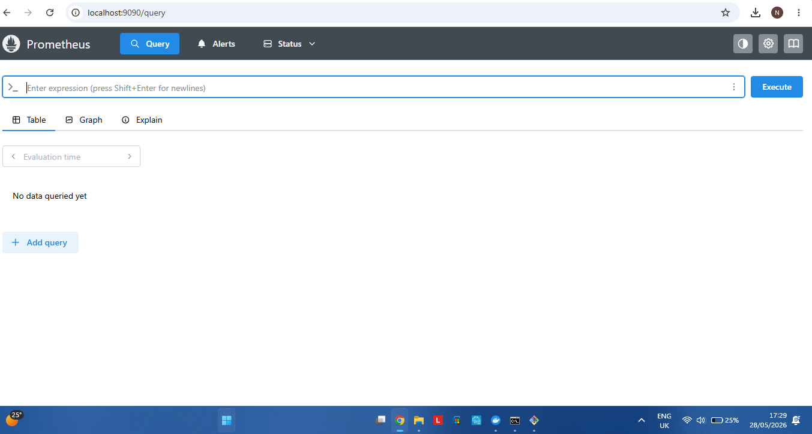
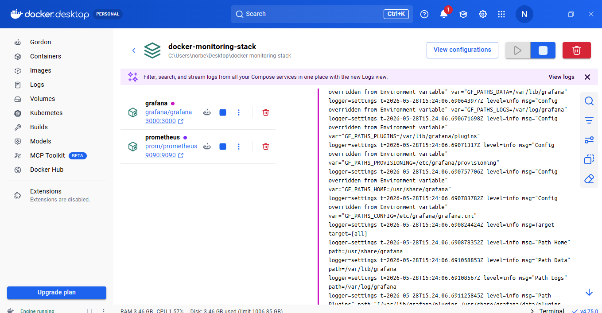

# Docker Monitoring Stack

Monitoring stack project using Docker, Grafana, and Prometheus.

## Technologies Used

- Docker
- Docker Compose
- Grafana
- Prometheus

## Features

- Containerized monitoring setup
- Grafana dashboard
- Prometheus metrics collection
- Docker container management

## Services

| Service | Port |
|---|---|
| Grafana | 3000 |
| Prometheus | 9090 |

## Screenshots

### Grafana Dashboard



### Prometheus Dashboard



### Docker Containers



## Commands Used

```bash
docker compose up -d


\### Docker Containers


!\[Docker Containers](screenshots/docker-containers.png)


\## Commands Used


```bash

docker compose up -d

